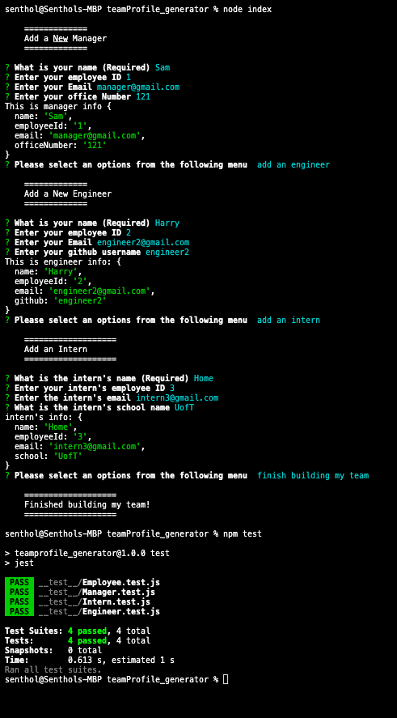
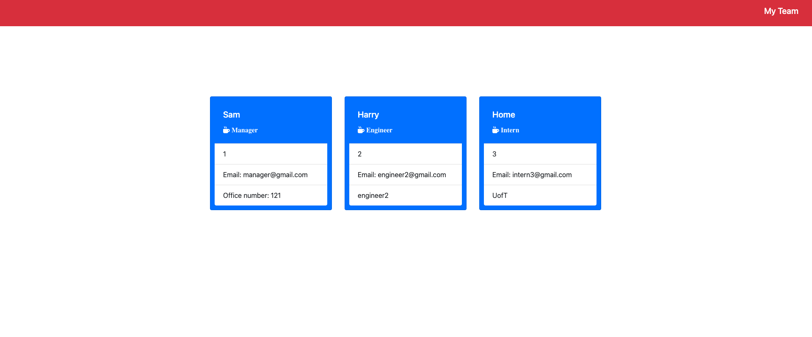

# teamProfile_generator

## Description

This is a command-line application that ask questions to users about employees and generates HTML page that displays information of each employee . All tests are passed using jest.

## Table Of Contents

- [Description](#description)
- [Technologies Used](#technology-used)
- [Installation](#installation)
- [Usage](#usage)
- [License](#license)
- [Questions](#questions)

## Technologies Used

- HTML
- CSS
- Javascript
- Node.js
- Inquirer
- Jest

## Installation

Steps:

- clone repository
- install node
- npm i

## Usage

For Demo click [here](https://drive.google.com/file/d/1Dd0IZUzvWuVgGySeHDBO-GOxs-Wkozjx/view?usp=sharing)

To run the application use "node index" from the terminal.

To test object classes use "npm test" from the terminal

Preview:

Command Line Image:

Generated Site Image:

## License

Licensed under MIT

# Questions

Reach out for any questions:

GitHub : katochsenthal

Email: katoch.senthal@gmail.com
